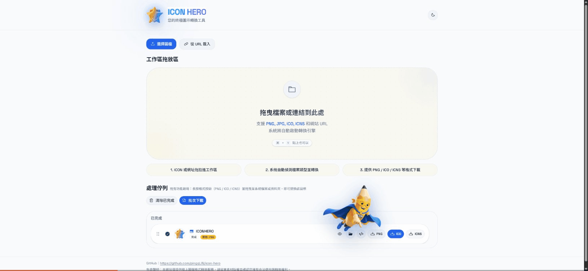
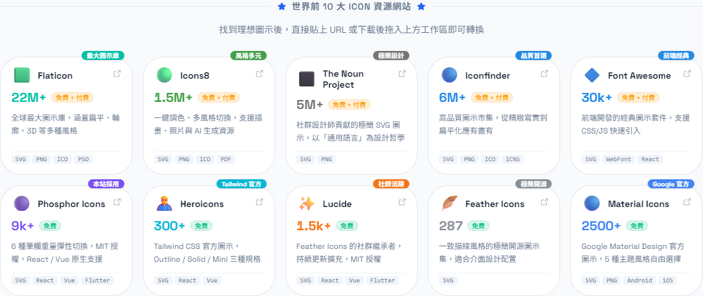
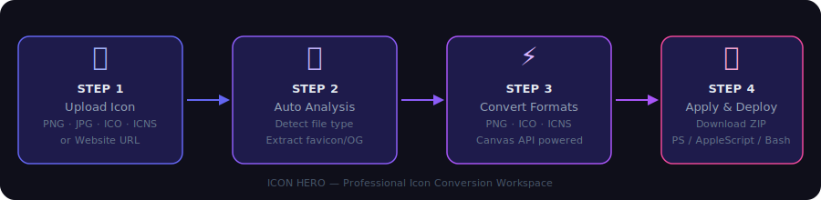
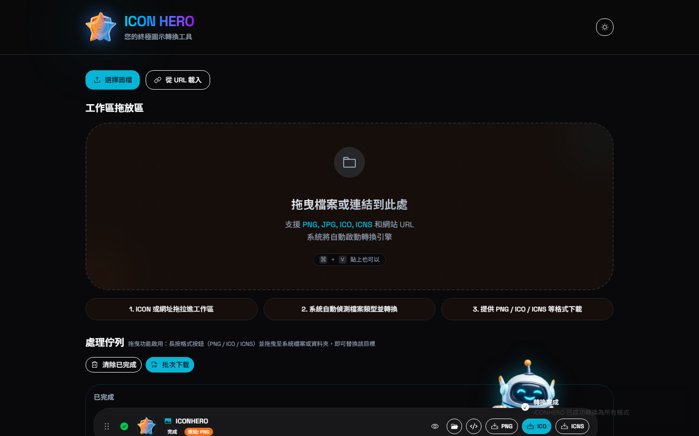

<p align="center">
  
</p>

<h1 align="center">ICON HERO</h1>

<p align="center">
  <b>瀏覽器圖示轉換與自動化工具包</b><br>
  將任意圖片轉換為 PNG · ICO · ICNS，並自動化跨平台圖示替換
</p>

<p align="center">
  <b>💡 100% 本地運算 — 您的檔案不會離開瀏覽器。</b>
</p>

<p align="center">
  <a href="https://github.com/pingqLIN/icon-hero/actions/workflows/deploy.yml">
    
  </a>
  
  
  
  <a href="LICENSE"></a>
</p>

<p align="center">
  <a href="https://pingqlin.github.io/icon-hero/">🌐 線上體驗</a> •
  <a href="#-功能特色">功能特色</a> •
  <a href="#️-操作步驟">操作步驟</a> •
  <a href="#️-平台支援">平台支援</a> •
  <a href="README.md">English</a>
</p>

---

## ✨ 功能展示

<p align="center">
  
</p>

> 拖曳圖片、輸入網址，或直接貼上 — ICON HERO 自動轉換為三種格式，並生成可直接執行的自動化腳本。

---

## ⚡ 功能特色

- **格式轉換** — 支援 PNG、JPG、ICO、ICNS 輸入，同時輸出三種格式（PNG + ICO + ICNS）
- **多種輸入方式** — 上傳檔案、拖曳放置、剪貼簿貼上、或輸入任意網站 URL
- **URL 解析** — 自動擷取網站的 favicon 與 Open Graph 圖片（受限於 CORS/CSP，部分網站可能失敗）
- **視覺拖曳追蹤** — 拖曳圖示至資料夾時顯示即時動畫軌跡（建議使用 Chromium 系瀏覽器）
- **自動化腳本生成** — 產生 PowerShell、Bash 及 osascript 批次替換腳本
- **一鍵打包下載** — 將圖示 + 腳本 + 說明文件打包為 ZIP 檔
- **批次處理** — 工作區佇列同時處理多個圖示
- **雙主題系統** — Neon Forge（暗色）與 Creative Studio（亮色），含動態吉祥物動畫

---

## 🎨 雙主題切換

<table>
  <tr>
    <td align="center" width="50%">
      
      <br><b>Creative Studio</b> — 亮色主題搭配英雄吉祥物
    </td>
    <td align="center" width="50%">
      
      <br><b>Neon Forge</b> — 暗色主題搭配機器人吉祥物
    </td>
  </tr>
</table>

---

## 🌍 全球 Top 10 Icon 資源

<p align="center">
  
</p>

在工作區下方（footer 上方）新增了「全球 Top 10 Icon 資源」區塊，方便直接比較網站風格、授權與圖示量級。

| 網站 | 圖示數 | 授權 | 特色 |
|------|--------|------|------|
| Flaticon | 22M+ | 免費 + 付費 | 最大圖示庫 |
| Icons8 | 1.5M+ | 免費 + 付費 | 風格多元 |
| The Noun Project | 5M+ | 免費 + 付費 | 極簡設計 |
| Iconfinder | 6M+ | 免費 + 付費 | 品質首選 |
| Font Awesome | 30k+ | 免費 + 付費 | 前端經典 |
| Phosphor Icons | 9k+ | 免費 | 本站採用 |
| Heroicons | 300+ | 免費 | Tailwind 官方 |
| Lucide | 1.5k+ | 免費 | 社群活躍 |
| Feather Icons | 287 | 免費 | 極簡開源 |
| Material Icons | 2500+ | 免費 | Google 官方 |

---

## 🗺️ 操作步驟

<p align="center">
  
</p>

### 詳細說明

**第一步：輸入圖示**

```
方式 A：點擊「選擇圖檔」選取本機檔案
方式 B：點擊「從 URL 載入」貼上任意網站網址
方式 C：直接拖曳圖檔至工作區拖放區
方式 D：使用 ⌘/Ctrl + V 貼上剪貼簿圖片
```

**第二步：等待自動轉換** — 佇列會顯示即時處理進度

<p align="center">
  
</p>

**第三步：下載圖示**

| 操作 | 方式 |
|------|------|
| 下載單一格式 | 點擊 **PNG**、**ICO** 或 **ICNS** 按鈕 |
| 拖曳至資料夾 | 長按格式按鈕並拖曳至目標位置（僅限 Chromium 系瀏覽器） |
| 批次下載 ZIP | 點擊佇列上方的 **批次下載** 按鈕 |

**第四步：生成自動化腳本** — 點擊佇列項目的 `</>` 按鈕

<p align="center">
  
</p>

```
① 選擇平台：Windows / macOS / Linux
② 輸入目標資料夾路徑（支援直接拖曳資料夾）
③ 點擊「生成腳本」預覽腳本內容
④ 複製貼上，或下載為腳本檔案直接執行
```

> 生成的腳本在您的**本機電腦**執行，與瀏覽器無關，不需要伺服器。

---

## 🖥️ 平台支援

| 平台 | 格式 | 腳本語言 | 實作方式 |
|------|------|----------|----------|
| **Windows** | ICO | PowerShell | `desktop.ini` + `IconResource` |
| **macOS** | ICNS | Bash + osascript | `fileicon` CLI 或 `osascript` fallback |
| **Linux** | PNG | Bash | `gio set metadata::custom-icon`（GNOME/Nautilus） |

### 注意事項

- **macOS**：腳本優先使用 `fileicon`，請以 `brew install fileicon` 安裝；未安裝時自動 fallback 至 `osascript`。
- **Linux**：`gio` 方式適用於 GNOME 桌面環境（Ubuntu、Fedora 等），其他桌面環境可能需要調整。
- **Windows**：腳本透過 `desktop.ini` 設定資料夾圖示，需允許執行 PowerShell 腳本（`Set-ExecutionPolicy RemoteSigned`）。

### 腳本功能特色

- **路徑正規化** — 支援 `%USERPROFILE%`、`~`、混合斜線
- **模糊搜尋** — 路徑不完全符合時自動在上層目錄搜尋
- **批次套用** — 一次設定多個目標路徑
- **雙模式輸出** — 複製貼上版（含暫停指令）與下載執行版

### 瀏覽器相容性

| 功能 | Chrome/Edge | Firefox | Safari |
|------|-------------|---------|--------|
| 格式轉換 | ✅ | ✅ | ✅ |
| URL favicon 擷取 | ✅ | ✅ | ✅ |
| 拖曳至資料夾下載 | ✅ | ❌ | ❌ |
| 剪貼簿貼上 | ✅ | ✅ | ✅ |

---

## 🛠️ 技術架構

| 分類 | 技術 |
|------|------|
| 框架 | React 19 + TypeScript |
| 建置工具 | Vite 7 |
| UI 元件 | Shadcn UI (Radix UI primitives) |
| 樣式 | Tailwind CSS 4 |
| 動畫 | Framer Motion |
| ZIP 打包 | JSZip |
| 圖示庫 | Phosphor Icons + Lucide React |

### 程式架構

```
Upload/URL Input
      ↓
workspaceAnalyzer.ts   ← 分析檔案、擷取 favicon
      ↓
iconConverter.ts       ← Canvas API → PNG / ICO / ICNS
      ↓
WorkspaceQueue         ← 即時狀態顯示
      ↓
scriptGenerator.ts     ← PowerShell / Bash / osascript
iconApplyPackager.ts   ← ZIP 打包（圖示 + 腳本 + README）
```

---

## 🚀 本地開發

**環境需求：** Node.js 18+

```bash
# 安裝依賴
npm install

# 啟動開發伺服器 (http://localhost:5173)
npm run dev

# 建置正式版本
npm run build

# 預覽建置結果
npm run preview
```

---

## 🤝 參與貢獻

歡迎提交 Issue 與 Pull Request，建議重大變更前先開 Issue 討論。

---

## 🤖 AI 輔助開發聲明

本專案使用 AI 工具輔助開發（程式碼生成與文件撰寫）。

**使用的 AI 模型/服務：** Claude Sonnet 4.6 (Anthropic)、Gemini 2.5 Pro (Google)

> ⚠️ **免責聲明：** 作者已盡力審查並驗證 AI 生成的程式碼，但無法保證其正確性、安全性或適用性。使用風險由使用者自行承擔。

---

## 📜 授權條款

[MIT License](LICENSE) — Spark Template 相關資源版權所有 © GitHub, Inc.
