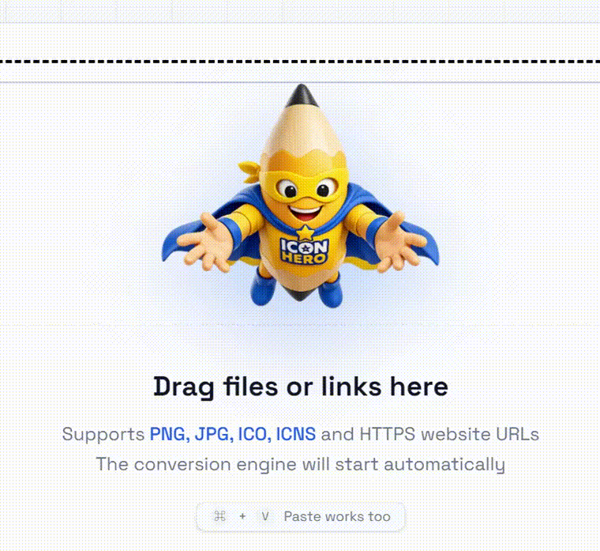
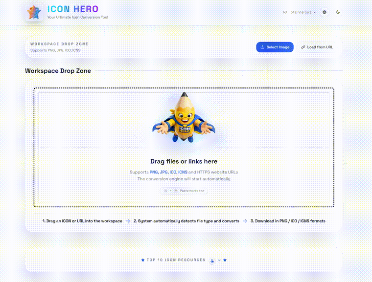
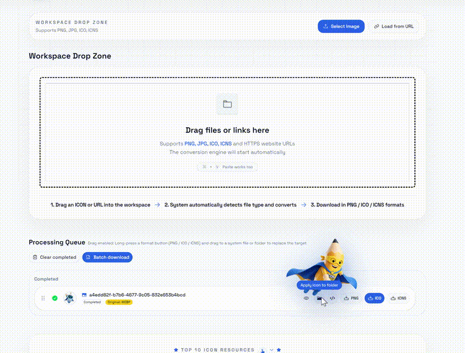

<p align="center">
  
</p>

<h1 align="center">ICON HERO</h1>

<p align="center">
  <b>Online icon converter for PNG · ICO · ICNS</b>
</p>

<p align="center">
  <a href="https://pingqlin.github.io/icon-hero/"><b>Launch Icon Hero</b></a> ·
  Browser-side · No upload required
</p>

<p align="center">
  <a href="https://github.com/pingqLIN/icon-hero/actions/workflows/deploy.yml">
    
  </a>
  
  
  <a href="LICENSE"></a>
</p>

<p align="center">
  <a href="https://pingqlin.github.io/icon-hero/">Live Website</a> ·
  <a href="#三步驟完成圖示轉換">Quick Start</a> ·
  <a href="README.md">English</a>
</p>

---

## 為什麼使用 Icon Hero

Icon Hero 是一個可以直接在線上使用的圖示轉換工具。你不需要安裝桌面軟體，也不需要把素材交給雲端服務處理；只要開啟網站，就能把設計稿、Logo、截圖或 favicon 轉成常用圖示格式。

- **即開即用**：進入線上網站即可開始轉換，適合臨時整理專案圖示或快速交付素材。
- **多格式一次完成**：同時輸出 PNG、ICO、ICNS，覆蓋網站、Windows、macOS 與一般專案需求。
- **多種輸入方式**：支援本機圖片、拖曳、剪貼簿貼上，以及 HTTPS 網址擷取。
- **批次下載**：多個圖示可以一次打包，減少重複下載與整理時間。
- **本機隱私**：轉換在瀏覽器內完成，圖片不會離開你的裝置。
- **最重要的是**：因為很可愛。

<p align="center">
  
</p>

---

## 三步驟完成圖示轉換

### 1. 加入圖片

點選上傳、拖曳圖片到頁面、貼上剪貼簿圖片，或輸入 HTTPS 網站網址。Icon Hero 會自動分析可用素材。

<p align="center">
  
</p>

### 2. 等待即時轉換

工作區會顯示每個項目的處理狀態，完成後可直接取得 PNG、ICO、ICNS。

<p align="center">
  
</p>

### 3. 下載或套用

下載單一格式、批次打包 ZIP，或依平台產生可複製與下載的本機腳本，用來快速套用資料夾或應用程式圖示。

<p align="center">
  
</p>

---

## 適合誰使用

| 使用者 | 可以快速完成 |
|--------|--------------|
| 設計師 | 將 Logo 或視覺素材整理成交付用圖示 |
| 前端與 App 開發者 | 快速取得網站、桌面與專案所需格式 |
| 內容創作者 | 把頻道、社群或活動素材轉成一致的 icon |
| 一般使用者 | 替資料夾、捷徑或個人專案準備圖示 |

---

## 支援內容

| 類型 | 支援 |
|------|------|
| 輸入 | PNG、JPG、ICO、ICNS、剪貼簿圖片、HTTPS URL |
| 輸出 | PNG、ICO、ICNS、ZIP 批次包 |
| 線上使用 | Chrome、Edge、Firefox、Safari |
| 進階套用 | Windows PowerShell、macOS shell/osascript、Linux shell |

> 拖曳已轉換圖示到檔案總管的體驗，建議使用 Chrome 或 Edge。

---

## 版權提醒

Icon Hero 協助轉換圖片格式，但不代表取得第三方 Logo、吉祥物、插圖或 icon set 的使用授權。若要將轉換後的圖示用於公開網站、商業專案、App Store、客戶交付或品牌素材，請先確認原始圖片來源、授權條款與使用範圍。

---

## 開始使用

前往線上網站：

<p align="center">
  <a href="https://pingqlin.github.io/icon-hero/"><b>https://pingqlin.github.io/icon-hero/</b></a>
</p>

想在本機開發或自訂版本時，可使用：

```bash
npm install
npm run dev
npm run build
```

---

## 授權

[MIT License](LICENSE) — Spark Template 相關資源版權所有 © GitHub, Inc.
