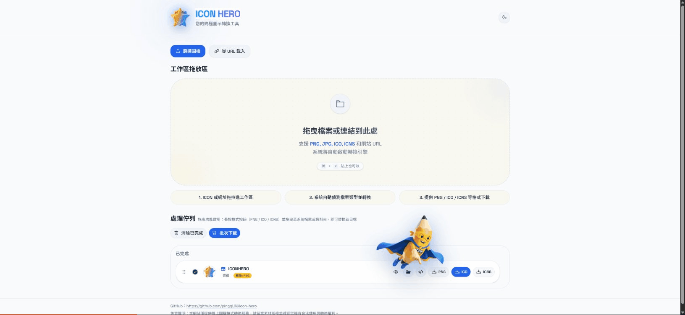
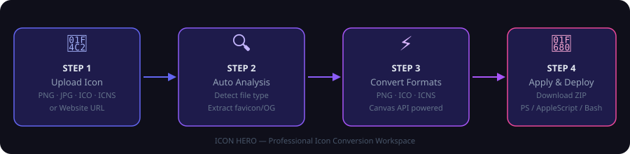
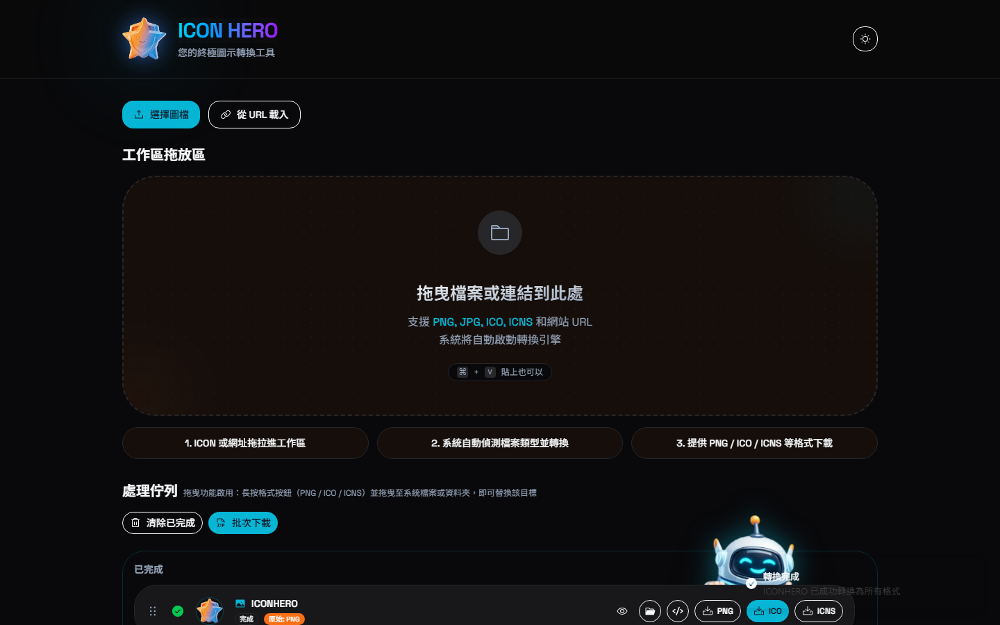
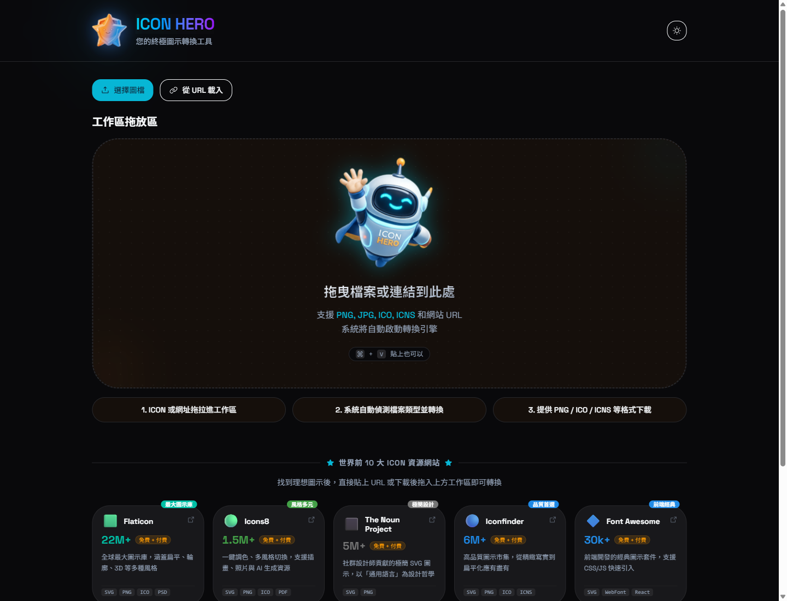
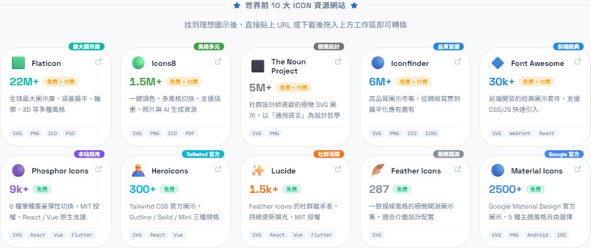

<p align="center">
  
</p>

<h1 align="center">ICON HERO</h1>

<p align="center">
  <b>Convert any image to PNG, ICO, and ICNS in your browser — then generate ready-to-run scripts to apply icons on Windows, macOS, and Linux.</b>
</p>

<p align="center">
  <b>No uploads. No server. No friction.</b><br>
  <b>100% client-side — your files never leave your browser.</b>
</p>

<p align="center">
  <a href="https://github.com/pingqLIN/icon-hero/actions/workflows/deploy.yml">
    
  </a>
  
  
  
  <a href="LICENSE"></a>
</p>

<p align="center">
  <a href="https://pingqlin.github.io/icon-hero/">🌐 Live Demo</a> •
  <a href="#-why-icon-hero">Why ICON HERO</a> •
  <a href="#-core-features">Core Features</a> •
  <a href="#-how-it-works">How it Works</a> •
  <a href="#-platform-support">Platform Support</a> •
  <a href="README.zh-TW.md">中文版</a>
</p>

---

## ✨ Why ICON HERO?

Most icon tools stop at conversion. ICON HERO finishes the workflow.

It helps you go from a single image to a usable cross-platform icon pack in one browser-based flow:

- **Convert once** → export **PNG / ICO / ICNS**
- **Generate scripts** → ready for **Windows / macOS / Linux**
- **Package everything** → icon + script + README in a **ZIP bundle**
- **Keep it local** → no uploads, no server, no privacy tradeoff

### Best for

- Developers customizing app or folder icons
- Designers preparing cross-platform icon assets
- Anyone who wants icon conversion without uploading files

---

## 🎬 Demo

<p align="center">
  
</p>

> Drag & drop any image, paste from clipboard, or enter a URL — ICON HERO converts it to PNG, ICO, and ICNS, then helps you generate ready-to-run scripts in one flow.

---

## ⚡ Core Features

### Conversion & Input

- **Multi-format conversion** — Convert PNG, JPG, ICO, or ICNS input into **PNG + ICO + ICNS** outputs simultaneously
- **Flexible input** — Import from local file, drag & drop, clipboard paste, or website URL
- **URL parsing** — Best-effort extraction of favicon and Open Graph images from a webpage (subject to CORS/CSP limitations)
- **Batch workspace** — Process and manage multiple icons in a queue

### Automation & Packaging

- **Script generation** — Generate PowerShell, Bash, and osascript workflows for icon application
- **One-click packaging** — Bundle icon + script + README into a downloadable ZIP file
- **Drag-to-folder workflow** — Long-press and drag converted assets directly to folders in Chromium-based browsers

---

## 🗺️ How it Works

<p align="center">
  
</p>

### 1. Import

Choose any of these input methods:

```text
Option A: Click "Select File" (選擇圖檔) to pick a local file
Option B: Click "Load from URL" (從 URL 載入) and paste any website URL
Option C: Drag & drop a file directly onto the workspace
Option D: Paste an image with ⌘/Ctrl + V
```

### 2. Convert

ICON HERO auto-processes the image and shows real-time progress in the workspace queue.

<p align="center">
  
</p>

### 3. Download

| Action | How |
|--------|-----|
| Download single format | Click **PNG**, **ICO**, or **ICNS** |
| Drag to folder | Long-press a format button and drag to any folder (Chromium only) |
| Batch download (ZIP) | Click **Batch Download** (批次下載) in the queue header |

### 4. Apply

Click the `</>` button on any queue item to open the script generator.

<p align="center">
  
</p>

```text
① Select platform: Windows / macOS / Linux
② Enter target folder paths (supports drag & drop)
③ Click "Generate Script" (生成腳本) to preview
④ Copy and paste the script, or download as a file to run directly
```

> The generated scripts run **outside the browser** on your local machine.

---

## 🖥️ Platform Support

ICON HERO does not stop at conversion — it also helps you apply icons on each platform with the right format and scripting workflow.

| Platform | Format | Script | Method |
|----------|--------|--------|--------|
| **Windows** | ICO | PowerShell | `desktop.ini` + `IconResource` |
| **macOS** | ICNS | Bash + osascript | `fileicon` CLI or `osascript` fallback |
| **Linux** | PNG | Bash | `gio set metadata::custom-icon` (GNOME/Nautilus) |

### Notes

- **macOS** — The script tries `fileicon` first. Install it with `brew install fileicon`; the script falls back to `osascript` if unavailable.
- **Linux** — The `gio` method works on GNOME-based desktops such as Ubuntu and Fedora. Other desktop environments may work differently.
- **Windows** — The script sets folder icons via `desktop.ini`. The PowerShell execution policy must allow scripts. For example: `Set-ExecutionPolicy RemoteSigned`.

### Script Features

- **Path normalization** — Handles `%USERPROFILE%`, `~`, and mixed slashes
- **Fuzzy search** — Locates folders even with minor path mismatches
- **Batch apply** — Set multiple target paths at once
- **Two execution modes** — Copy-paste version with pause, or downloadable file version for direct execution

### Browser Compatibility

| Feature | Chrome/Edge | Firefox | Safari |
|---------|-------------|---------|--------|
| Format conversion | ✅ | ✅ | ✅ |
| URL favicon fetch | ✅ | ✅ | ✅ |
| Drag-to-folder download | ✅ | ❌ | ❌ |
| Clipboard paste | ✅ | ✅ | ✅ |

---

## 🛠️ Tech Stack

| Category | Technology |
|----------|-----------|
| Framework | React 19 + TypeScript |
| Build | Vite 7 |
| UI Components | Shadcn UI (Radix UI primitives) |
| Styling | Tailwind CSS 4 |
| Animation | Framer Motion |
| ZIP Packaging | JSZip |
| Icons | Phosphor Icons + Lucide React |

### Architecture

```text
Upload / URL Input
        ↓
workspaceAnalyzer.ts   ← Analyzes files, fetches favicons
        ↓
iconConverter.ts       ← Canvas API → PNG / ICO / ICNS
        ↓
WorkspaceQueue         ← Real-time status display
        ↓
scriptGenerator.ts     ← PowerShell / Bash / osascript
iconApplyPackager.ts   ← ZIP bundle with icon + script + README
```

---

## 🎨 Dual Theme

<table>
  <tr>
    <td align="center" width="50%">
      
      <br><b>Creative Studio</b> — Light theme with Hero mascot
    </td>
    <td align="center" width="50%">
      
      <br><b>Neon Forge</b> — Dark theme with Robot mascot
    </td>
  </tr>
</table>

Two visual themes for different moods: **Creative Studio** for a bright workspace, and **Neon Forge** for a darker, more futuristic look.

---

## 🌍 Icon Resources

<p align="center">
  
</p>

The workspace includes a curated icon resources section for quick discovery, inspiration, and style comparison.

| Website | Icon Count | License | Highlight |
|---------|------------|---------|-----------|
| Flaticon | 22M+ | Free + Paid | Largest icon library |
| Icons8 | 1.5M+ | Free + Paid | Wide style coverage |
| The Noun Project | 5M+ | Free + Paid | Minimal design system |
| Iconfinder | 6M+ | Free + Paid | Premium-quality sets |
| Font Awesome | 30k+ | Free + Paid | Frontend classic |
| Phosphor Icons | 9k+ | Free | Used by this project |
| Heroicons | 300+ | Free | Official Tailwind icons |
| Lucide | 1.5k+ | Free | Active open-source community |
| Feather Icons | 287 | Free | Minimal open-source set |
| Material Icons | 2500+ | Free | Official Google set |

---

## 🚀 Local Development

**Requirements:** Node.js 18+

```bash
# Install dependencies
npm install

# Start dev server (http://localhost:5173)
npm run dev

# Build for production
npm run build

# Preview production build
npm run preview
```

---

## 🤝 Contributing

Issues and pull requests are welcome. Please open an issue first to discuss major changes.

---

## 📜 License

[MIT License](LICENSE) — Spark Template resources © GitHub, Inc.

---

## 🤖 AI-Assisted Development

This project was developed with AI assistance for code generation and documentation.

**AI Models/Services Used:** Claude Sonnet 4.6 (Anthropic), Gemini 2.5 Pro (Google)

> ⚠️ While the author has reviewed and validated the generated code where possible, no guarantees are made regarding correctness, security, or fitness for any particular purpose. Use at your own risk.
